# Intro to GPIO
- GPIO stands for General Purpose Input/Output
- Can see if external voltage applied, can drive a voltage, etc.

GPIO pin physical structure
- GPIO output bit -> Controller -> P/NMOS (PMOS VCC, NMOS ground) -> Output Pin
  - Controller will invert the bit before sending it to the PMOS/NMOS
    - Aka to drive a 1, we need the PMOS to be on and the NMOS to be off
    - To drive a 0, controller drives NMOS on, resulting in draining external current to ground

### Know what each element of the GPIO pin actually does
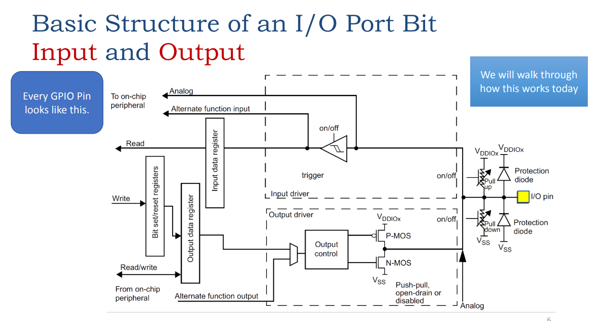

### BSRR
- 16 bits for setting
- 16 bits for resetting
  
### BRR
- lower 16 bits for resetting

***

- Open-Drain
  - If in open-drain and writing a 1, the NMOS is not on so output floats
  - If in open-drain and writing a 0, the NMOS is on and output is grounded
  - PMOS is always off

- Slew Rate
  - Max rate of change of output voltage: $\text{Slew Rate} = \text{Max}(\frac{\triangle V}{\triangle t})$
  - Aka the ramp up/down rate of the output voltage

Pull Up/Down Resistors
- If external circuit only pulls low, we need a pull up resistor to pull high
- If external circuit only pulls high, we need a pull down resistor to pull low and drain off excess current
- Very high resistance so that it doesn't interfere with the external circuit until we want it to

Port-mapped versus memory-mapped I/O
- Port-mapped I/O: Every peripheral has a unique address
- Memory-mapped I/O: Every peripheral has a unique address, but it is in the same address space as the memory

# Interrupts
*Instead of polling, we can use interrupts to handle events*

Program Counter
- Holds the address of the next instruction to be executed

Interrupts
- Stored in the interrupt vector table
- Each interrupt has a set **priority**, **enable**, and **pending** bit
- Interrupt flow:
    1. Peripheral raises interrupt
    2. Enabled?
    3. Pending gets asserted
    4. Priority is checked
    5. if higher priority than current interrupt, then interrupt is taken and CPU state is pushed to stack
    6. Interrupt handler is executed via writing to the PC

### Nested Interrupt flow:
- Since ISR 1 finishes / has higher priority before ISR2 is raised, CPU state is only saved during Main Program Execution.
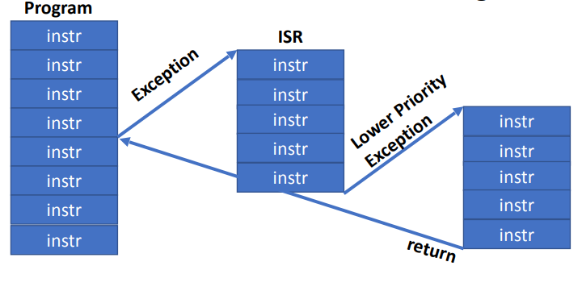

# Timers
Systick timer has a LOAD register, which is the value that the timer counts down from. When it reaches 0, it will reset to the value in the LOAD reg. 

**TIME PERIOD FOR SYSTICK**: $T = \frac{LOAD + 1}{f_{clk}}$ since we need a cycle to reset the timer on interrupt

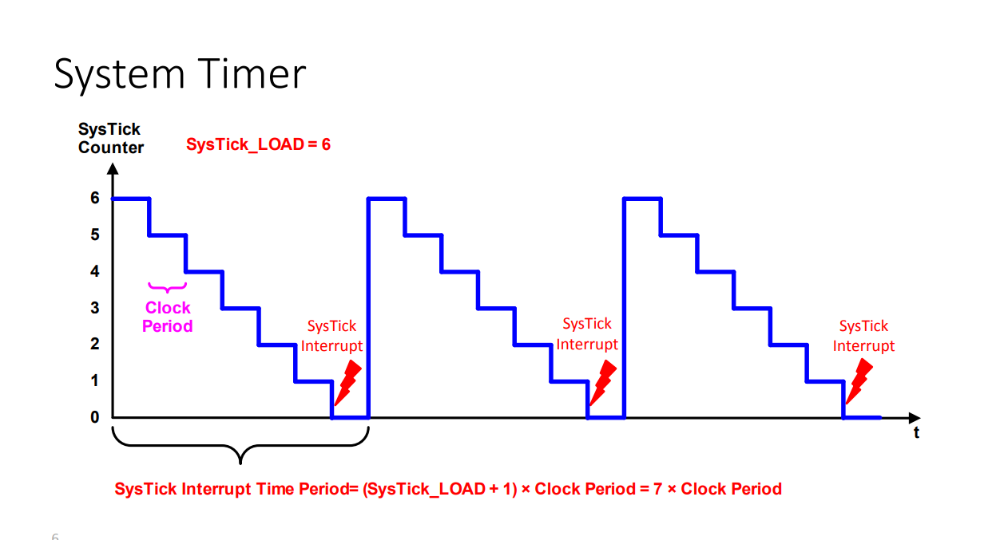

Calculating things about systick:
- **CALCULATE RELOAD FOR A SPECIFIC INTERVAL**: $\text{RELOAD} = \frac{Goal Time}{Period_{clk}} - 1$
- **IF HAVE PRESCALER**: $\text{RELOAD} = \frac{Goal Time}{Period_{clk} * \text{(Prescalar + 1)}} - 1$

# Debouncing
- Hardware: RC filter
- Software: Delay or prior state tracking using binary
- if 10ms bound, and we scan one of four rows every 1ms, worst possible byte history is: 00000101. 

# Multiplexing Seven Segment Display
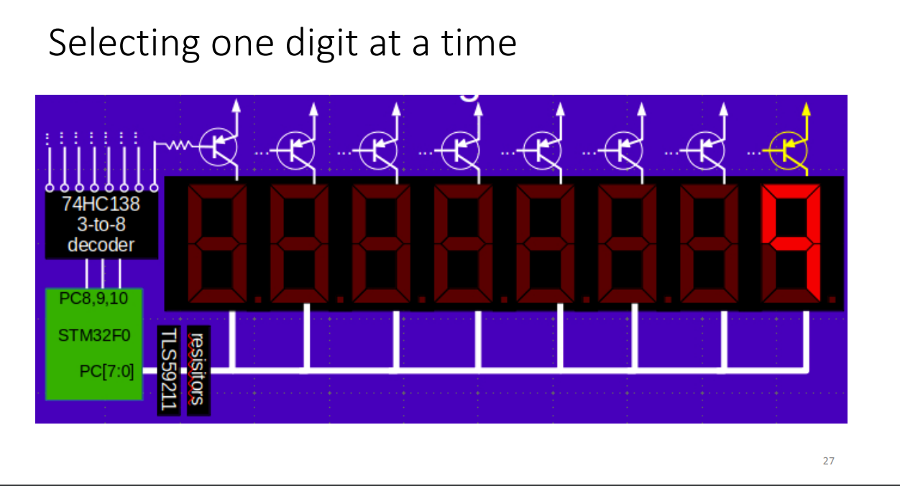

Top FETs determine which digit is being displayed, bottom sink registers determine which segments are on

# DAC - Digital to Analog Converter
### Formula for Conversion from Digital to Analog
$$ \boxed{DAC_{out} = V_{ref} * \frac{\text{Digital Value}}{2^n - 1}} $$

### Fixed Point Representation of Numbers

$$ \overset{\boxed{128}}{\boxed{0}} \overset{\boxed{64}}{\boxed{1}} \overset{\boxed{32}}{\boxed{0}} \overset{\boxed{16}}{\boxed{1}} \overset{\boxed{8}}{\boxed{1}} \overset{\boxed{4}}{\boxed{1}} \overset{\boxed{2}}{\boxed{0}} \overset{\boxed{1}}{\boxed{1}} \text{ . } \overset{\boxed{1/2}}{\boxed{1}} \overset{\boxed{1/4}}{\boxed{0}} \overset{\boxed{1/8}}{\boxed{1}} \overset{\boxed{1/16}}{\boxed{0}} \overset{\boxed{1/32}}{\boxed{0}} \overset{\boxed{1/64}}{\boxed{0}} \overset{\boxed{1/128}}{\boxed{0}} \overset{\boxed{1/256}}{\boxed{0}}  = \text{93.525}$$

*Note: Standard binary addition and subtraction works for fixed point numbers, but multiplication needs a corrective shift. Fixed-point is also INEXACT.*

### Physical DAC Structure
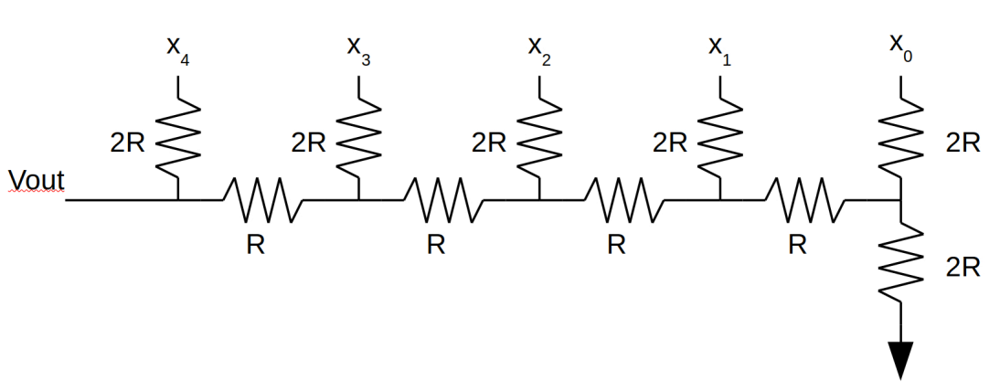

X_n is the digital input, which is fed from a NMOS/PMOS switch. The switch is controlled by the digital input. The output is the voltage at V_out.

**Calculate acceptable error in DAC resistors:** $\text{Error} = \frac{1}{2^n - 1}$

**Frequency of DAC:** $f_{DAC} = \frac{samples/sec}{\text{samples per cycle}}$

### What can we use DAC for?
- Slow things
  - process control, etc.
- DAC can be updated very quickly (100k+/sec)
  - Audio, video, etc.

# ADC: CT to DT Conversion

### ADC Resolution:
$$ \boxed{\text{ADC Out} = \text{round(}(2^{n} - 1) * \frac{V_{input}}{V_{REF}} \text{)}} $$

### Example for 10-bit ADC, V_in = 1V, V_REF = 5V: 

$\text{ADC Out} = \text{round(}(2^{10} - 1) * \frac{1}{5} \text{)} = \text{round(204.6) = 205 = 0xCD}$

**Least significant bit voltage:** $\frac{V_{REF}}{2^n - 1}$
- This is the smallest voltage change that the ADC can detect

### Floor versus Round: 
In floor, max error is a full LSB since we are always rounding down. In round, max error is half an LSB since we are rounding to the nearest integer.

### Determine Current Guess
SAR will always use 2 cycles for sampling, so will have N-2 cycles to guess the value.

**Max quantization error:** $\frac{1}{2} * \frac{V_{REF}}{2^n - 1} = \frac{1}{2} * \text{LSB}$

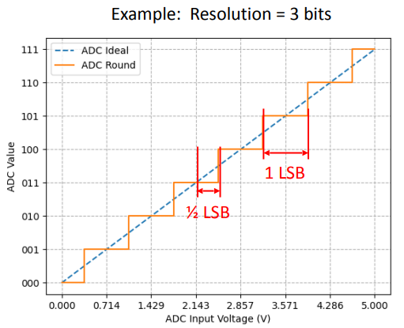

### ADC Sampling Rate
- **Nyquist Sampling Theorem:** Sampling rate must be at least twice the highest frequency component of the signal

### ADC Structure
- Successive Approximation Register (SAR) ADC
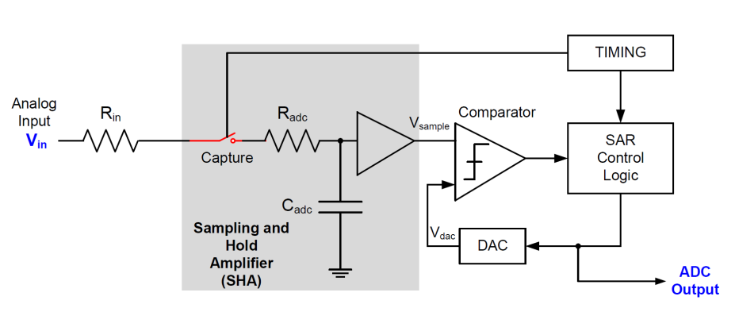

Will start at MSB and work its way down to LSB, comparing the output of the DAC to the input voltage. If the DAC output is greater than the input voltage, then the bit is set to 0. If the DAC output is less than the input voltage, then the bit is set to 1.

### Determine Minimum Sampling Time
Want to settle to within 1/2 LSB (one max quantization error) of the input voltage.

Has a sampling period, and then will repeatedly check if V_sample is higher/lower than V_dac, and adjust V_dac via setting bits accordingly.
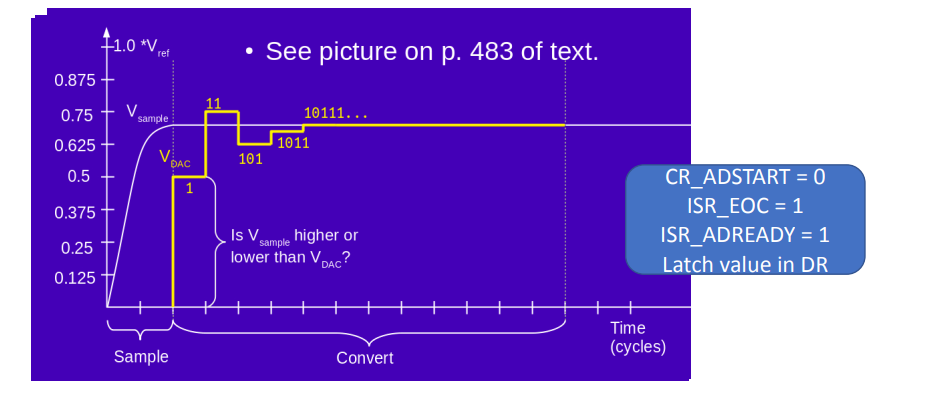

### Jitter
- Jitter is the variation in the sampling period
- Can be caused by noise, etc.
- Can be reduced by averaging multiple samples via boxcar averaging

# DMA

Moving memory from one location to another makes poor use of CPU... so we make a co-processor called DMA which does this WITHOUT CPU invervention.

Typically, CPU needs to read mem/peripheral and then write to mem, and not do anything else in the meantime. DMA can do this for us.

- **Flow-Through:** Data flows through DMA on way from mem/periph to destination
- **Fly-By:** Data flies by DMA on way from mem/periph to destination, but does not go through DMA. 

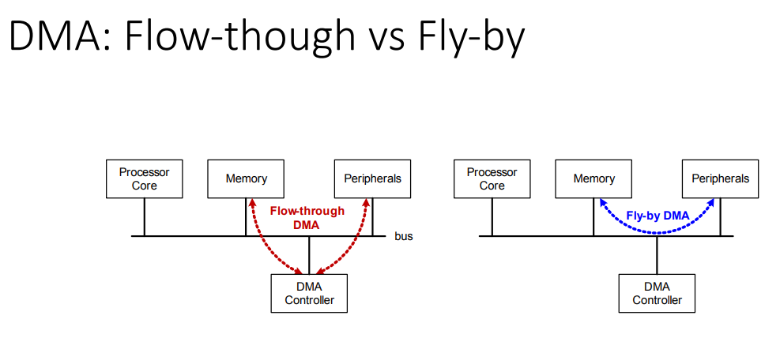

### How does DMA Controller actually work?
- Sits on the bus
- Stores a list of source/dest pairs

# Advanced Timers and PWM

Counter Modes: Up, Down, Up/Down
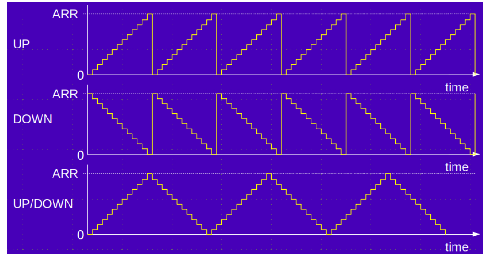

Types of counters:
- **Count Up, Active High:** Counts up, goes high when ARR reaches CCR value and stays high
- **Count Up, Toggle Mode:** Counts up, toggles when ARR reaches CCR value. Changing CCR offsets the signal.
- **Count Up/Down, Toggle Mode:** Counts up, toggles when ARR reaches CCR value, counts down, toggles when ARR reaches CCR. Changing CCR affects active cycle of wave, but alwayd centered. 
- **Count Up, PWM mode 1:** Counts up, high between 0 and CCR. Changing CCR changes duty cycle.

### What is PWM: Outputs a digital waveform (0 or 1) with a specific duty cycle and frequency.

Using GPIO as a DAC: Each timer will be in PWM mode, start high and then go low when reaches CCR. We then average the result to get a voltage. We can also dynamically change the duty cycle to change the voltage.

Must be a high frequency to avoid flickering.

### Power Inefficiency of DAC

**DAC can change voltage incrementally, however you would not use it for a large load since will always be drawing current.**

**However for PWM, we can use it for a large load since it is either conducting fully or not conducting at all.**

# Example Problems

1. In this question you are sampling from a sinewave table. Assuming your DAC output rate is 500kHz and the minimum number of samples needed per wave iteration is 20, if you have a wavetable of sufficiently large size, what is the maximum frequency you can produce without distortion?
   - We want waves / second so via dimensional analysis: 
      
      $\frac{\text{500000 samples}}{\text{1 second}} \times \frac{\text{1 wave}}{\text{20 samples}} \rightarrow 25000 \text{ waves/second}$
2. Given DAC output rate of 500000 Hz, and we need 20 samples to avoid distortion, and we have 10k samples in wavetable, what step size is required to produce the 25000Hz frequency?
    - We want 

      $\frac{\text{100000 samples}}{\text{1 table}} \times \frac{\text{1 wave}}{\text{20 samples}} = \text{500 steps per wave}$

# Sound Generation

We can generate a table of discrete values for a sinewave, and then use a DAC to convert it to an analog signal.

- Adjusting the DAC rate allows us to refine the output frequency of the wave
- We can also simply adjust the step size of the table to adjust the frequency instead of changing the DAC rate
- More generally, the way we set the frequency of the signal output is:

$$ \boxed{\text{Frequency} = \text{Step Size} \times \frac{\text{FDAC}}{\text{Table Size N}}} $$

**Fractional Stepping:** We can use a fractional step size to get a more accurate frequency. For example, if we have a step size of 1.5, then we will output the first value, then the second value, then the first value, then the second value, etc. This will result in a frequency that is 1.5 times the frequency of the table.

$$ \boxed{\text{Step Size} = \text{Goal Freq} \times \frac{\text{Table Size N}}{FDAC}} $$

This will utilize **fixed point** arithmetic, which is described above at [Fixed Point Representation of Numbers](#fixed-point-representation-of-numbers).

- **To get the whole number part of a fixed point number:** Shift right by the number of fractional bits (i.e. if Q16.16, shift right by 16)

- Can produce simultaneous waves by adding the values of the two waves together

- **Pitch Bending:** We can change the frequency of the wave by changing the step size. This will result in a change in frequency, but not a change in the waveform itself.

# Serial Communication

### Types of Communication
- **Synchronous:** Clock signal is sent along with data (SPI, I2C, USART)
- **Asynchronous:** Clock signal is not sent along with data (UART)

## SPI - Syncronous
- **Master/Slave:** Master controls the clock, slave does not
- Operates via shifting bits in on MOSI and out on MISO (each clock cycle)
- Fairly fast, but requires 4 wires (MOSI, MISO, SCLK, NSS)

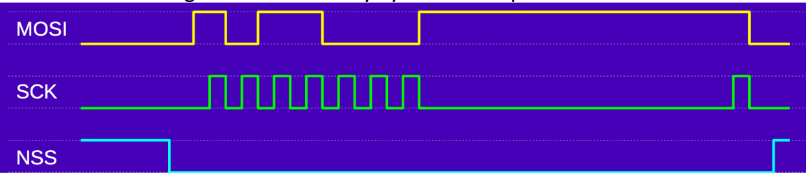
a
**Using multiple slave devices:** We can have multiple NSS pins on the master, and each slave will have its own NSS pin. The master will assert the NSS pin of the slave it wants to communicate with, and the other slaves will ignore the data.

**SPI Shift Register:** One data input pin to specify the next bit, clock shifts in the new data, one more pin stores/outputs the new data.

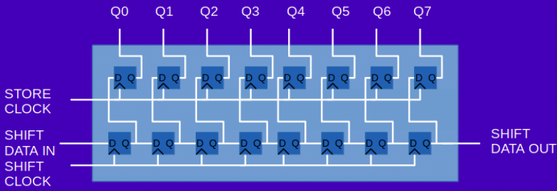

- Shift pattern into reg via DIN and SH_CK
- Store pattern to output regs using ST_CK

if we want to chain shift registers and hook up to SPI device:
- SHIFT DATA IN connected to MOSI since this will specify the next bit
- SHIFT CLOCK is connected to SCLK.
- STORE CLOCK is connected to NSS of SPI device since we want to store new data once we select a slave.

General structure of sending data:
1. NSS goes low to select slave
2. Send data on MOSI (SHIFT DATA IN occurs here, so data is now in internal shift register)
3. Pulse SCLK to (SHIFT CLOCK occurs here, so data is now stored in output register)
4. Pulse NSS to store data in slave (STORE CLOCK occurs here, so data is now on output pins of slave)

We can also use GPIO instead of NSS to have a SPI chain of any length.

Gentle Art of Multiplexing
- We can hook up a few pins from the STM32 using SPI, one pin for NSS, one for data, and one for clock.
- We can now shift in basically one bit for each of the signals into the shift register. the same bits go down into the bottom shift register as the top, and then we can use the latch pin to latch the data into either the top or bottom shift register (we can pick)

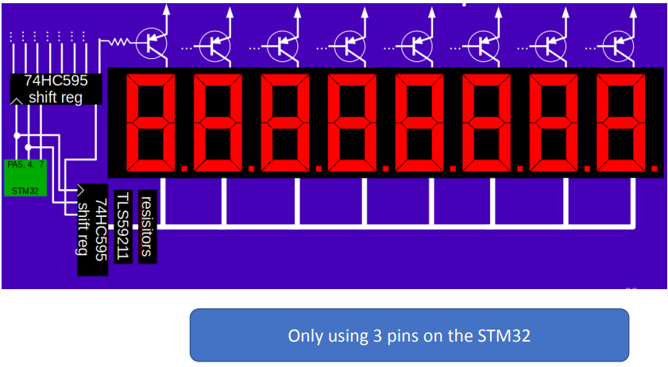

SD Card:
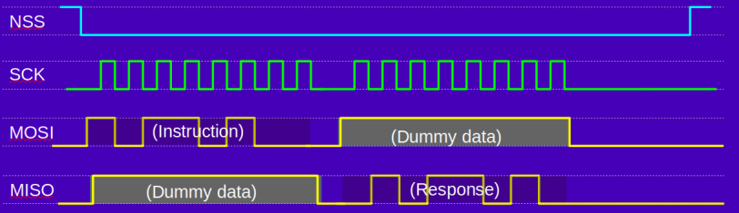

## UART - Asynchronous

- Start bit is always 0, stop bit is always 1
- Parity bit is either 0 or 1 depending on if we want even or odd parity
  - Helps detect SINGLE-BIT errors

- Baud rate is the number of signal changes per second (NOT the number of bits per second)
  - Data rate will be baud / number of signal changes per bit

### Standard UART Serial Protocol:
- High when Idle
- Start bit is low
- Data bits are sent LSB first
- Stop bit is high
- Parity bit is even/odd/none
- Clocking
  - Clock syncs on **falling edge** of start bit
  - Wait 1.5 clocks to start sampling in **middle** of data bit

Serial Baud Rate Error Tolerance:
- Baud rate of receiver must be within 5% of baud rate of transmitter 
  - 1.05^8 = 1.477 (not more than halfway off at the 8th bit, so will read everything correctly)

Serial Errors:
- Framing Error: Didn't see a stop when detected (Clock out of tolerance? Packet format wrong?)
- Receiver Overrun: Receiver didn't read a received byte before a new one came in (Receiver too slow? Baud rate too high?)
- Parity Error: Parity bit didn't match (Noise?)

RS-232
- -15 to +15V
  - -3 -> -15 is a high signal
  - +3 -> +15 is a low signal
  - -3 -> 3 is invalid

## I2C - Synchronous
- Two bidirectional lines: SDA and SCL
  - SDA and SCL are pulled high by resistors (are open-drain, so high impedance of output is 0)
- Can have multiple masters and slaves all on the same bus

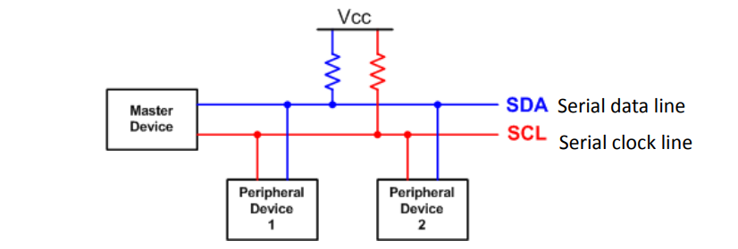

SPI vs I2C
- SPI is faster, but requires more wires
- I2C is slower, but requires less wires
- SPI is full duplex, I2C is easier for adding a new slave

- Any device can be a master or a slave, or both. It's convenient to easily connect multiple devices together using only two wires in total, so doesn't matter it's slower than SPI.

### What does I2C communication look like?
- Any device sends start bit (SDA goes low while SCL is high)
- Master sends slave address
- Master sends read/write bit
- Listen for ACK/NACK (low if ACK, high if NACK)
- Master sends data (**MSB first**)
- Sends a stop bit (SDA goes high while SCL is high)

**Sending Data**
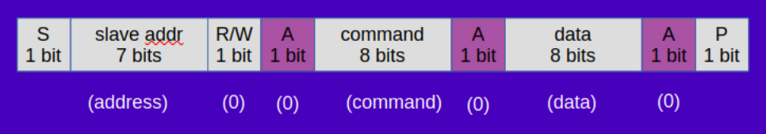
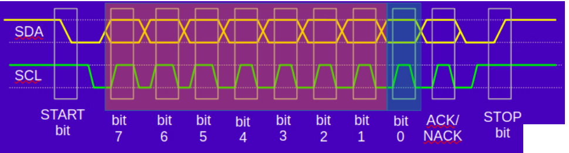

Master can actually send a byte, follow up with another start bit, and then read from the slave. The transaction ends with a NACK instead of ACK in this situation.

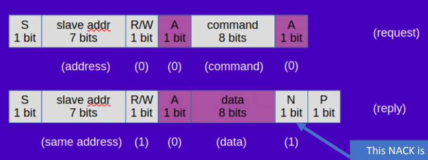

**Clock stretching:** Any device on I2C bus can lengthen low time of the clock, but only after ACK and before MSB of next byte. This is used to slow down the master if it is too fast.

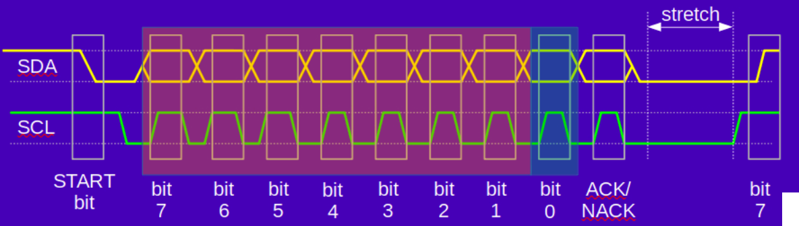

# This is the end of the notes for exam 1. Good luck!

Helpful Quizlet I made based on these notes and homework solutions: https://quizlet.com/836266341/ece362-exam-1-purdue-flash-cards/