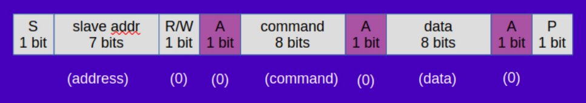
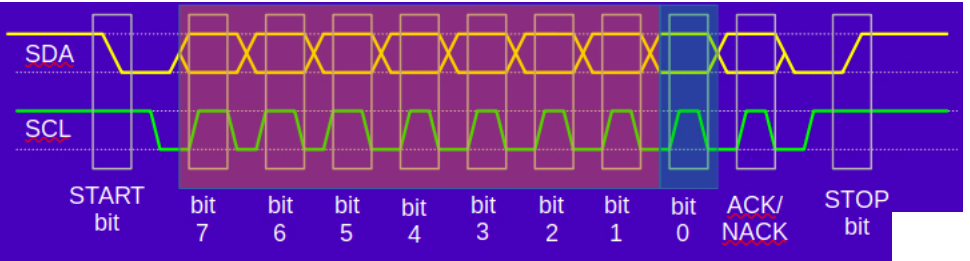
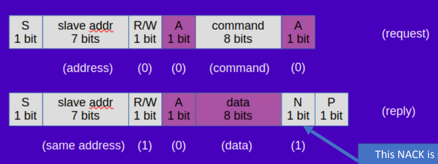

## I2C

- SDA and SCL configured in open-drain, synchronous protocol
- devices can only pull low, so hooked up to high via a resistor

SPI vc I2C
- both are synchronous for short distances
- SPI is faster, but requires more wires
- I2C is slower, but only requires 2 wires (SDA and SCL)

- Baud rate
  - 100kHz (standard mode)
  - 400kHz (fast mode)
  - 1MHz (fast mode plus)
  - 3.4MHz (high speed mode)
  - speed also limited by
    - capacitance of the bus
    - strength of pull up resistor

I2C is multi-master
- any device can transition between master and slave

Actual I2C signals look like:
- SDA and SCL are pulled high
- any device starts by sending a start bit (SDA goes low while SCL is high)
- then the device sends 7 bits of address (of slave), followed by a read/write bit
- 1-bit intent to read or write
- then listens for ACK/NACK bit from the slave
- semd stop bit (SDA goes high while SCL is high)

All I2C data is MSB bit first

The below is an example of master writing a command and a single data byte to a slave device

Master can actually send a byte, follow up with another start bit, and then read from the slave. The transaction ends with a NACK instead of ACK in this situation.

