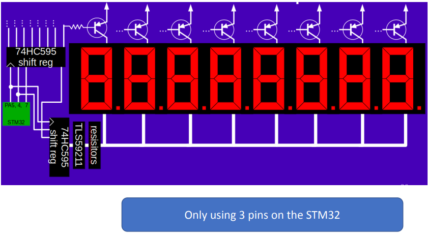

# Sept 27, UART and SPI

### Longer chains of shift registers
  - if we use GPIO instead of NSS, we can have as many shift registers as we want
  
### The art of Multiplexing
  - multiplexing is a way to save pins
  - we can hook up a few pins from the STM32 using SPI, one pin for NSS, one for data, and one for clock.
    - We can now shift in basically one bit for each of the signals into the shift register. the same bits go down into the bottom shift register, and then we can use the latch pin to latch the data into either the top or bottom shift register.

## UART
- universal asynchronous receiver transmitter
- asynchronous means that there is no clock signal
- We simply send bits one after another, and the receiver has to figure out when the bits start and stop

## Parity
- parity is a way to check if the data is correct
- this works by adding an extra bit to the end of the data, which is either 0 or 1 depending on the number of 1's in the data
- if the number of 1's is even, the parity bit is 0, and if the number of 1's is odd, the parity bit is 1
- So if we send 0b0101 but the receiver gets 0b0100, the parity bit will be 1, and the receiver will know that the data is incorrect

## baud rate vs bit rate
- baud rate is the number of times we can change a signal per second
- bit rate is the number of bits we can send per second
- For example, for some data protocols we have additional control info which does not count towards the bit rate, so if we need 11 signal change durations to send 8 bits of data, and the baud rate is 9600, we need to divide 9600 by 11 to get the bit rate = 8xx bits per second

## Real serial protocols
- If we wanna send 0xd5, we are high while idle and start bit is low
- Start bit is low
- we sent **the LSB first**
- Parity can be configured to even/odd/none
- Stop bit goes high

## Real hardware implementation
- RS-232 (1960)
- Voltage range is -15 to +15 volts
- A high signal is represented from -3 -> -15
- A low signal is represented from +3 -> +15
- Anything between -3 and +3 is undefined
  - Aka you cannot use 3V logic / drivers with RS-232

## What about clock rate differences?
- Both transmitter and receiver must have a clock, so it's very hard to get clock synced
  - How do we fix this?
- Clocks will always sync at the falling edge of the start bit
- Waits 1.5 clocks from when sees falling edge of start bit, then samples the data
  - Each subsequent bit is sampled after 1 clock (will be center of bit)
- Resync on next start bit again

### Drifting
- Even if we sync up on falling edge of start bit, if the Tx is faster than Rx we will sample slightly late each time, potentially causing an error
- We can calculate max tolerance:
- if we are off by more than 1/2 bit time, we will sample the wrong bit
  - 1.05^8 = 1.4x so we will still be on correct bit
  - 1.05^9 = 1.5x so we will be on wrong bit

## Serial errors
- Framing error: didn't see a stop bit when we wanted to (clocks out of sync? disagree on package format?)
- Receiver overrun: receiver didn't read out a received byte before a new one started (sys/oftware too slow?)
- Parity error: parity bit didn't match the data (noise?)

***

# I2C - Inter-Integrated Circuit
- Very cheap, medium-data-rate, 2-wire (SDA and SCL), serial, bidirectional, synchronous
- I2C is configured open-drain for both SDA and SCL
- High by default via resistors tied to VCC for SDA and SCL, so all devices can only pull low (high impedance state)