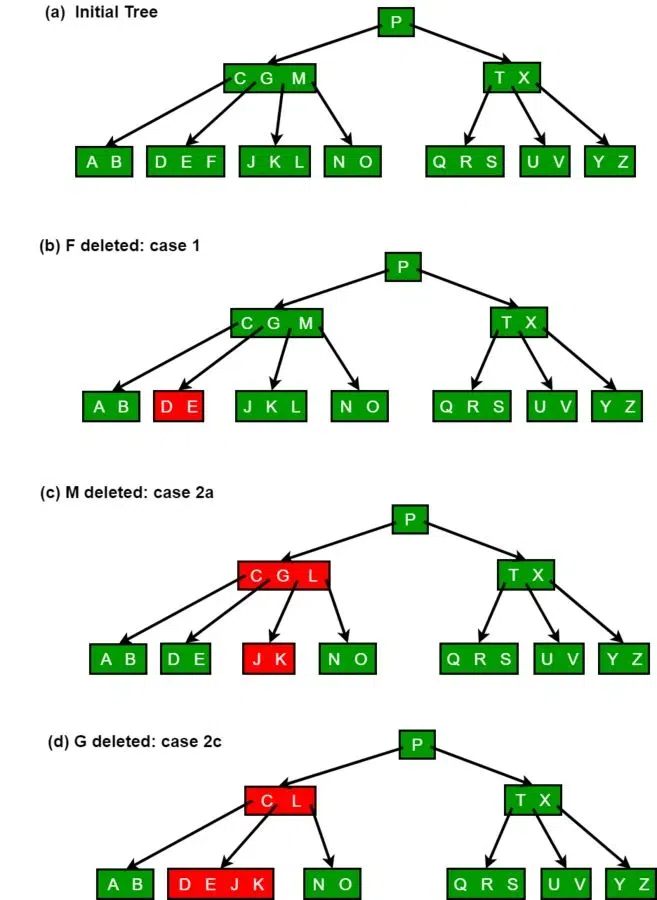

# B-Tree Homework covering

Start in `btree.h`. **USE ASSERTS for testing code.**

Will be writing: 1. `query_min`, `query_max`, `k_largest`, `k_smallest`.
Tests will not be comprehensive, but will be a good start.

### How to start:
Read B-Tree insert especially asserts to make sure I understand if my insertions will pass. Then query min/max, k_largest, k_smallest, and supports in delete.

**NEED TO USE WRAPPER FUNCTION `get_subtree()` or `set_subtree()` to index/change a subtree**. He has examples in `tree_insert.c` or whatever, showing the normal way and the replacement.

- Be careful with off-by-one errors using asserts.
- Ensure test-driven development.
- `add_key()` returns a compound literal.

Delete:
- If we remove something from a level, first can we just squeeze the remaining keys together in that level and satisfy the rule? Or do we need to borrow a key from child?

### Showing examples of deletion (use this tutorial on geeks4geeks)
