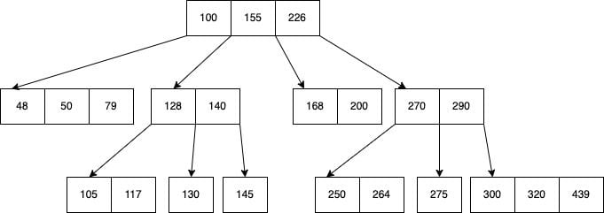

***
# Heap and Insertion and Whatnot
Trivia: Max value in heap is going to be at index 0 (root).

## `delete_root()`:
1. Copy last element to overwrite root
2. Shrink the heap (aka remove last element of array)
3. Heapify root

### Example:
```
       3               0              0                2
      / \             / \            / \              / \
     1   2   --->    1   2  --->    1   2     --->   1   0
    /               /                
   0               0                    swap max into root
                                            (heapify)
```

## `insert()`:
1. Append to array (requires resizing)
2. Bubble new value up to correct position

### Example:
```
      5                  5                    5        
     / \              /     \              /     \      
    3   2     --->   3       2  --->      3       4   
   / \              / \     /            / \     / \    
  1   0            1   0   4            1   0   2   6      
                     insert 4          bubble 4, add 6
```
```
       5                  5                    6                  
    /     \            /     \              /     \
   3       4   --->   3       6    --->    3       5         DONE
  / \     / \        / \     / \          / \     / \
 1   0   2   6      1   0   2   4        1   0   2   4
  same as last        bubble 6              bubble 6
```

## `bubble()`:
1. Compare with parent
2. If larger than parent, swap with parent
3. `idx_of_new` = `idx_of_parent`
4. Get new parent (`idx_of_parent = (idx_of_new - 1) / 2`)`


> Note: If we add a new leaf, heapify will not do anything since root is already max. We only heapify if we add a new **root**. Heapify joins a root with its left and right heaps.

### AVL-Balanced Tree:
- height of left and right subtrees differ by at most 1
- B = balance factor = height of left - height of right

### Complete Tree:
- every level full except maybe the last
- for heap, always fills from left

&nbsp;
***
# Fancy Trees 
- ### Keep tree balanced, good for in-memory databases, fast insertion/search:
  - **AVL trees** (apparently good for more searches)
  - **Red-black trees** (apparently good for more insertions)
- **B-trees** (good for expensive disk reads)
- **Splay trees** (fast access to recently accessed items)

## B-trees
**Purpose**: If we have 256 values in a BST, we have use `log_2(256) = 8` accesses at worst with a BST. What if we instead make the tree super wide and not so tall? Reduces number of depth accesses.

### <center>B-Tree Example</center>



For any level of a B-Tree, the number of keys is always one less than the number of children. The number of children is always one more than the number of keys.

Notice how at level 1 in the above, threre are 3 keys but 4 children. Aka children are on the fenceposts of the keys, not on the keys themselves.

### Splitting a node

$$
\boxed{\text{21}}\boxed{\text{33}}\boxed{\text{47}}\boxed{\text{59}}\boxed{\text{85}}\\ {} \\ \downarrow \\ {} \\
\boxed{\text{47}}  \\ {} \text{/} \space\space\space\space\space\space \backslash \\
\boxed{\text{21}}\boxed{\text{33}}  \space\space\space\space\space\space\space\space\space \boxed{\text{59}}\boxed{\text{85}}
$$

How does adding a new key work? If we add 42, we need to split the node. We take the middle value (47) and make it the new root. Then we take the left half and make it the left child, and the right half and make it the right child.

### Understand how insertion works!!!

### `insert`:
```
void insert(int value)
{
    // find the leaf node where value should go
    // if leaf node is full, split it
    // if root is full, split it
}
```